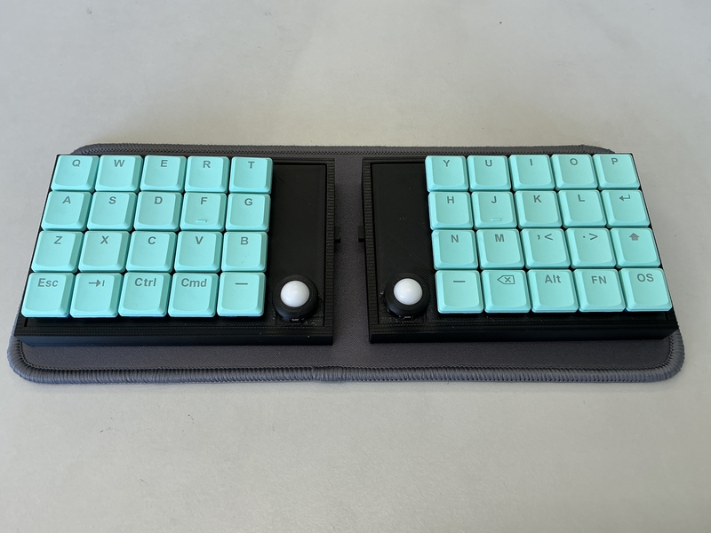

# cool640db

## What is cool640db?

cool640db is small keyboard with 2 trackballs.
 
cool640db is splite keyboards.
 
cool640db use seeed xiao ble,run zmk_firmware.
 
 

## firmware

[zmk-config](https://github.com/telzo2000/zmk-config-cool640db)

 
keymap editor

https://nickcoutsos.github.io/keymap-editor/

 
zmk studio

https://zmk.studio/

 

自作キーボードへのzmk_firmwareのインストールについて

https://sizu.me/m_ki/posts/kvixkn2mec6a

 
zmk_firmwareでのキーマップ編集について

https://sizu.me/m_ki/posts/m3devs7be5km

 

## buildguide

https://github.com/telzo2000/cool640db/blob/main/buildguide_for_cool640db.md

 

## BOM

| No. | Patrs | Quantity | remarks | Suppliers | Cost |
|--|--|--|--|--|--|
|番号|名前|数|備考|調達先|参考価格（送料込）| 
|1|PCB|4|Rightside,Leftside, Trackball|[elecrow](https://www.elecrow.com) [JLCPCB](https://jlcpcb.com) [ALLPCB](https://www.allpcb.com)|| 
|2|Switch plate|2|3D Print|||
|3|Bottom case|2|3D Print|||
|4|Battery On/Of swith knob|2|3D Print|||
|5|Slide switch スライドスイッチ|2||[秋月電子](https://akizukidenshi.com/catalog/g/g115370/)|１個30円|
|6|AAAA Battery case 単４電池ケース|2||[マルツオンライン](https://www.marutsu.co.jp/pc/i/59151/?srsltid=AfmBOoo5ctOn9kOUGJA7pCL4M2f4Y3IolfSweL7epFytDI-BLKNBKMa8)|１個81円|
|7|XIAO nRF52840|2|MCU Board|[seeed studio](https://jp.seeedstudio.com/Seeed-XIAO-BLE-nRF52840-p-5201.html?msclkid=5541f7f3d0f911eca6023fe520de5bfa) [秋月電子](https://akizukidenshi.com/catalog/g/g117341/)[Talp keyboards](https://shop.talpkeyboard.com/products/seeed-studio-xiao-nrf52840-xiao-ble)|1900円ぐらい|
|8|Trackball トラックボール|2|12mm級|[Amazon](https://www.amazon.co.jp/uxcell-50個のPOMベアリングボール-12mm-ソリッドプラスチックベアリングボール-精密POMボール/dp/B0D3WG11YG)|80g1500円ほど|
|9|PWM3610|2|Trackball senser|[Talp keyboards](https://shop.talpkeyboard.com/products/pmw3610dm-sudu-lm18-lsi)|800円ぐらい|
|10|Diode ダイオード|40|SMD|[遊舎工房](https://yushakobo.jp) [Talp Keyboard](https://talpkeyboard.net) [Daily Craft Keyboard](https://shop.dailycraft.jp)等|100個で220円程度から|
|11|Swith socket スイッチソケット|40|choc|[遊舎工房](https://yushakobo.jp) [Talp Keyboard](https://talpkeyboard.net) [Daily Craft Keyboard](https://shop.dailycraft.jp)等|10個で165円程度|
|12|Screw ネジ|8|スリムヘッドM2 5mm|[遊舎工房](https://shop.yushakobo.jp/products/a0800s2?variant=37665432535201)|50本880円(遊舎工房)|
|13|Screw ネジ|22|M2 6mm|DIY shop|10本200円程度|
|14|Spacer スペーサー|8|M2 6mm|DIY shop|10本400円程度|
|15|Keyswitch キースイッチ|40|chocV1及びV2対応|[遊舎工房](https://yushakobo.jp) [Talp Keyboard](https://talpkeyboard.net) [Daily Craft Keyboard](https://shop.dailycraft.jp)|１個100程度|
|16|Keycap キーキャップ|40|ロープロが最適|[遊舎工房](https://yushakobo.jp) [Talp Keyboard](https://talpkeyboard.net) [Daily Craft Keyboard](https://shop.dailycraft.jp)||
|17|リセットスイッチ（タクトスイッチ）|2||[秋月電子](https://akizukidenshi.com/catalog/g/g108073/)|１個20円|
|18|PHコネクター コンタクト|4|SPH-002T-P0.5L|[秋月電子](https://akizukidenshi.com/catalog/g/g112837/)|100個で300円|
|19|PHコネクター ハウジング|2|2P PHR-2|[秋月電子](https://akizukidenshi.com/catalog/g/g112795/)|1個５円|
|20|PHコネクター ベース付ポスト サイド型|2|2P S2B-PH-K-S|[秋月電子](https://akizukidenshi.com/catalog/g/g112633/)|１個10円|
|21|ピンヘッダ　7ピン|2|トラックボール基板と本体基板の固定に使用。xiao bleに付属しているもので代用可能。||| 
|22|ボールベアリング|6|内径2mm×外径5mm×幅2.5mm|[Amazon](https://www.amazon.co.jp/dp/B07RHYDK65?ref=ppx_yo2ov_dt_b_fed_asin_title)|10個で800円|

In addition, NiHM rechargeable batteries (4 AAA size), USB cable, etc. are required.
 
この他に、NiHM充電池（単４形４本）、USBケーブル等が必要です。
 

 

# license

[CC BY-NC-SA](https://creativecommons.org/licenses/by-nc-sa/4.0/deed.ja)

