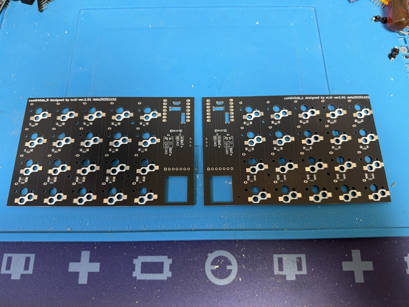
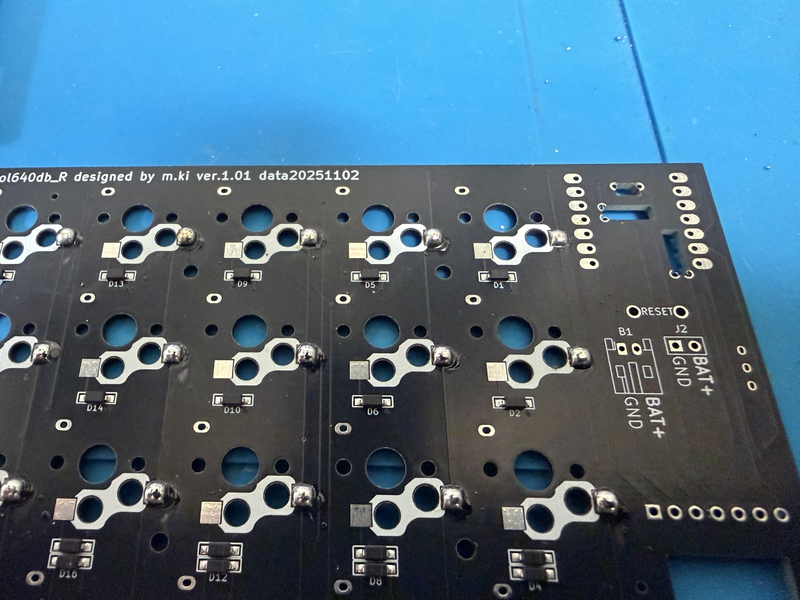
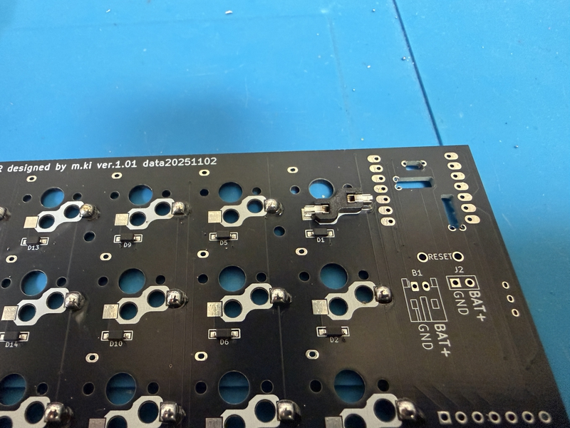
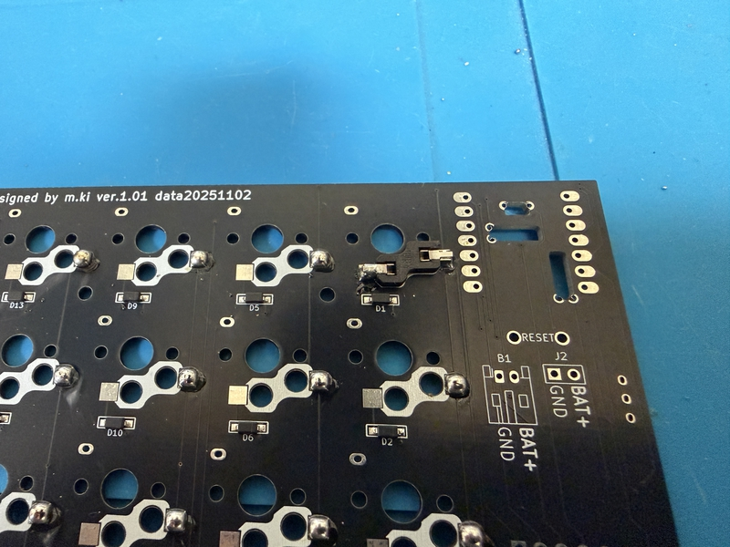

 　# Buildguide for cool640db
 

## 0 部品の確認

 
Follow the BOM on github's readme.md to make sure that all the parts are available.
 
githubのreadme.mdのBOMに沿って、部品が全て揃っているかを確認してください。
 
There are four PCBs. Of the three pieces, two are left and right keyboard boards, and the remaining two are  trackball boards.
 
Bが4枚あります。表裏を確認してください。4枚のうち、2枚が左右のキーボード基板で、残り2枚がトラックボール基板です。
 

## 1 ダイオードのはんだ付け

If the diode is already soldered, please skip this operation.
 
すでにダイオードのはんだ付けされている場合は、この作業を省略してください。
 
 
This work is done on the left and right keyboard boards respectively.
 
この作業は左右のキーボード基板でそれぞれ行います。
  
Solder the diodes to the back of PCB.
 
PCBの裏面にダイオードのハンダ付けをします。
 
The diode is compatible with SMD and lead type.
 
ダイオードは、SMDとリードタイプに対応しています。
 
Diodes have polarity, so be careful about the direction in which they are installed.
 
ダイオードには極性がありますので、取り付ける向きに注意してください。
 

[ダイオード（SMD)のはんだ付けの動画](https://youtu.be/ODk16bd4XkA)
 
[ダイオード（リードタイプ）のはんだ付けの動画](https://youtu.be/lbAQkKzNawM)
 
[ダイオード（リードタイプ）のはんだ付けの動画２](https://youtu.be/3hWZjaBROL8)

 

## 2  スイッチソケットのハンダ付け

cool640db supports chocswitch sockets.
 
cool640dbでは、chocのスイッチソケットに対応しています。

  
Solder the switch socket on the back of the left and right keyboard boards.
 
左右のキーボード基板の裏面にスイッチソケットのハンダ付けをします。
 

[Switch socketハンダ付け動画](https://youtu.be/ZnbgaueMR4w?si=_JLjD--3HJJ5Pu7Q)

 

## 3 Seeed xiao bleのハンダ付け

<b>Note</b>
次の動画を参考にしてください。
 

[xiao bleのハンダ付け動画](https://youtu.be/98yqLjzfdl4)

#

## 4 スライドスイッチのハンダ付け

Insert the switch from the front of the PCB with the switch knob facing outward.
 
スイッチのつまみが外側に向くようにして、PCBの表面から差し込みます。

After temporarily fixing it with masking tape, etc., solder the exposed part of the PCB.
 
マスキングテープなどで仮固定をしてから、PCBの裏面に出た部分をはんだ付けします。
 

[スライドスイッチのはんだ付けの作業動画](https://youtu.be/5nkRklibay4)

## 5　リセットスイッチのハンダ付け

Insert the reset switch from the bottom of the board.
 
基板の下面からリセットスイッチを挿入します。
 
Cut off any leads sticking out from the board using pliers or similar.
 
基板からはみ出たリードをニッパーなどで切り取ります。
 
Then, solder it.
 
その後、ハンダ付けをしてください。
 

[リセットスイッチハンダ付け動画](https://youtu.be/Pl24Exfh8b8)

## 6 JSTコネクタのはんだ付け

Insert the JST connector from the underside of the board, cut off any protruding leads with pliers, and then solder.
 
JSTコネクタを基板の下面から差し込み、はみ出たリードをニッパーで切り落としてから、はんだ付けをして下さい。
 

## 7 トラックボール基板の作成

Caution PMW3610 is prone to sensor damage when exposed to high temperature heat. Please complete the soldering of each pin in a short time.
 
注意　PMW3610は高温の熱にさらされるとセンサーの破損が発生しやすいです。それぞれのピンのはんだ付けは短時間で済ませてください。
 
As for my example, soldering is processed in 2-3 seconds per pin.
 
私の例ですが、はんだ付けを１つのピンにつき、2〜3秒で処理します。
 
 
Note: The silk of "Front side" and "Back side" on the board is written for the ball.
 
注意　基板に「Front side」や「Back side」のシルクは、ボールに対しての表記です。
 
 
The trackball board has components installed from the beginning. The implemented side is the back side.
 
トラックボール基板は最初から部品が実装されています。実装されている面を裏面とします。
 
 
Remove the PWM3610 acrylic parts.
 
PWM3610アクリル部品を取り外します。
 
 
Check the pin of the PMW3610 and insert it from the surface of the trackball board. Temporarily fix it with masking tape.
 
PMW3610のピンを確認して、トラックボール基板の表面から差し込みます。マスキングテープで仮固定します。

 
 
The back of the trackball board is facing up and the part that came out of the pin hole is soldered.
 
トラックボール基板の裏面を上向きにして、ピン穴からでた部分をはんだ付けします。
 
 
The lens part of the PMW3610 is covered with tape, so remove it.
 
PMW3610のレンズ部分がテープで覆われているので、それを外します。
 
 
From the back of the trackball board, cover the acrylic part on the PMW3610, and melt the acrylic on the back with a soldering ick to prevent it from coming off.
 
トラックボール基板の裏面の方から、アクリル部品をPMW3610に被せて、その裏側に出たアクリルをハンダごてで溶かして外れないようにします。

 
 

## 8 センサー基板のはんだ付け

The sensor board created in step 7 is fixed to the circuit board by soldering it with the pin head in between.
 
6で作成したセンサー基板を基板にピンヘッドを間に挟んではんだ付けして固定します。
 

Please refer to the diagram above when soldering. When doing so, use pliers or similar to cut off any protruding pin heads.
 
上の図を参考にして、はんだ付けをしてください。その際、はみ出たピンヘッドはニッパーなどで切り取ってください。
 

Note 
トラックボールセンサー基板のはんだ付けの成否を知らずに、基板にそれらをピンヘッドではんだ付けすることに不安のある場合は、７ピンの2.5mmコンスルーを使って、仮固定をすることを勧めます。仮固定で、動作に問題ないことを確認してから、コンスルーのはんだ付けをします（はんだ付けしないと、振動で外れることがあります）。
 
コンスルーの７ピンは通常では販売されていないので、12ピンをカッターなどで切断して用意してください。
 
 

## 9 スイッチプレートの組み立て（１）

Assemble the trackball part of the switch plate.
 
スイッチプレートのトラックボール部分の組み立てをします。
 

Use tweezers to insert the bearing from the inside, then insert a 6mm M2 screw from the outside to secure it in place.
 
ピンセットを使い、ベアリングを内側から挿入します。その後、外側からM2ネジ6mmを差し込んで固定します。
 
Do this in three places on each of the left and right switch plates.
 
この作業を左右のスイッチプレートで、それぞれ３箇所行います。
 
Once you've finished, insert the 12mm POM ball by pushing it in from above.
 
作業を終えたら、12mmPOM球を上から押し込むように入れます。
 

## 10 スイッチプレートの組み立て（２）

Stack the switch plate and PCB in this order from the top, and insert four M2 5mm screws from the top.
 
Fix the four points from the bottom of the PCB with M3 3mm spacers.
 
上からスイッチプレート、PCBの順番で重ねて、上からM2 5mmネジを４本差し込みます。
 
PCBの下からM3 3mmスペーサーで４箇所を固定します。
 
 
There are 4 places each on the left and right, a total of 8 places.
 
左右それぞれ4箇所で、合計8箇所行います。
 

## 11 スイッチの差し込み

Plug your favorite key switch into the one you made in section 8.
 
When plugging in, it may not be plugged in properly and the terminal of the key switch may bend.
 
Please be careful.
 
If it is bent, it can be repaired with radio pliers, etc., and it can be reused.
 
It's a mistake you often make, so don't worry about it, plug in the key switch more and more.

 
セクション8で作ったものに、自分のお気に入りのキースイッチを差し込みます。
 
差し込むときに、うまく差し込めず、キースイッチの端子が曲がってしまうことがあります。
 
気を付けてください。
 
もし曲がったときは、ラジオペンチなどで直しせば、再利用できます。
 
自分もよくやるミスなので、気にせず、どんどんキースイッチを差し込みましょう。
 
 

## 12　電池ケースの作成

## 13 ボトムプレートの取り付け

Insert four M2 6mm screws from the bottom of the bottom plate to secure it. The left and right bottom plates have different shapes, so please align them with the switch plate.
 
ボトムプレートの下面からM2 6mmネジを４箇所差し込んで、固定してください。ボトムプレートは左右の形が違いますので、スイッチプレートと向きを合わせてください。
 
 
The side with the recess to hide the screw heads will be the bottom of the bottom plate.
 
ネジの頭を隠すための窪みがある方がボトムプレートの下面になります。
 
 

## 14 キーキャップの装着

Please attach your favorite keycap (All 1U size).
 
お好きなキーキャップ（全て1Uサイズ）を装着してください。
 

## 14 完成

After attaching non-slip rubber to the bottom of the bottom case, it's done.
 
Please enjoy a life with a better keyboard.
 
ボトムケースの底面に、滑り止めゴムを取り付けたら、完成です。
 
よりよいキーボードのある生活を楽しんでください。
 

## 15 動作確認について

ファームウェアの導入について、こちらの記事を参考にしてください。
 
[自作キーボードへのzmk_firmwareのインストールについて](https://sizu.me/m_ki/posts/kvixkn2mec6a)

 
Keymapの編集について、こちらの記事を参考にしてください。

[zmk_firmwareでのキーマップ編集について](https://sizu.me/m_ki/posts/m3devs7be5km)

